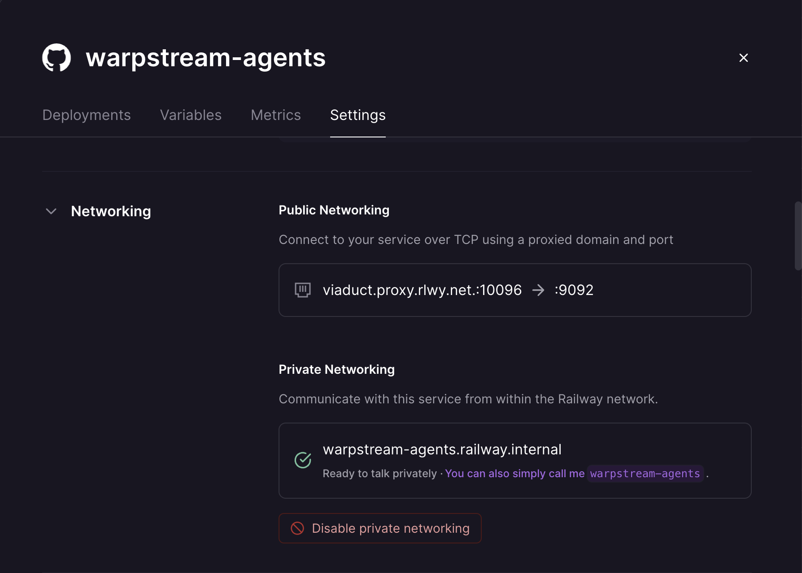
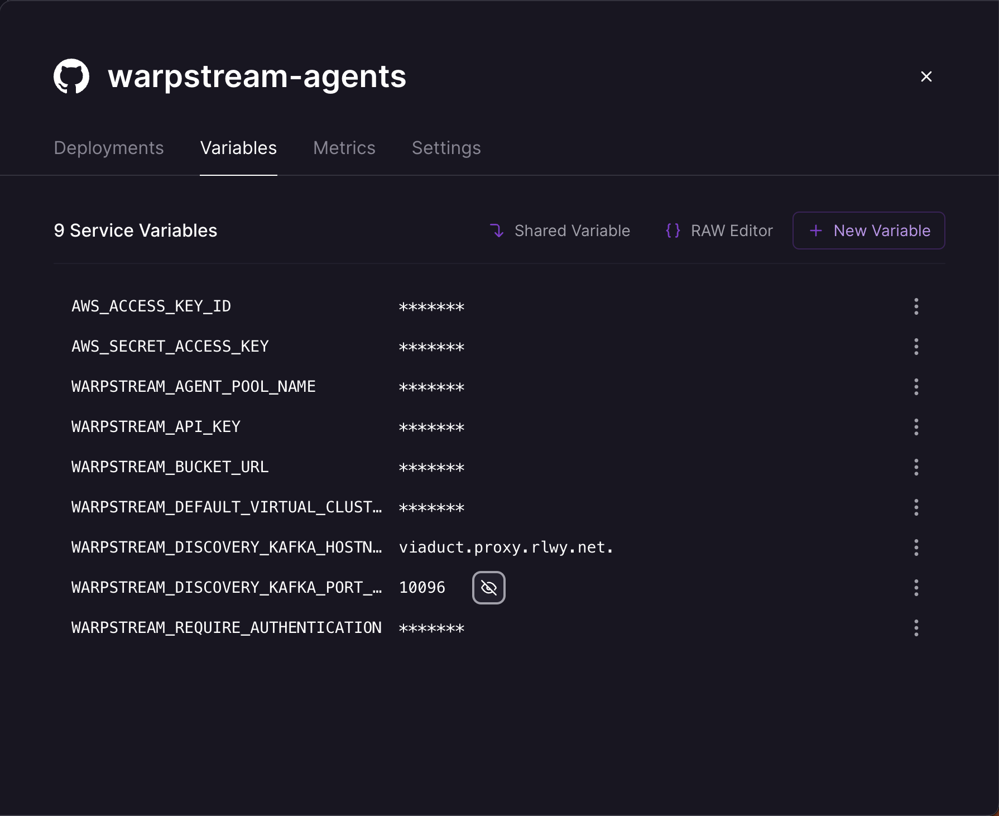

# Instructions

First, click the button above to deploy the WarpStream Agents on Railway.

Next, add a TCP proxy to the WarpStream Agents service.

Finally, go update the kafka hostname and port environment variables with the values of the Railway TCP proxy.

